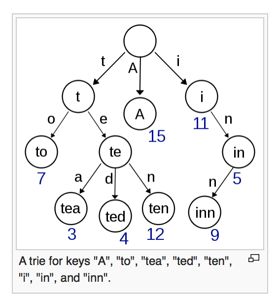

#Tries
A trie is a tree structure in which each node is treated as key value. Each node's key is actually a representation of its position within the tree. Thus the node with key of "ab" could be 2 levels done, whereby it's parent is a. Similarly a child of "ab" may be "abc" and thus be on the third level. Each node can carry with it a value.

##Image

##Usages
Some real world examples may be:

* Auto correct in a search box. The world "red hat" may have sub permutations of "red hate" and further from that a child node of "red hate" could be "red hater"