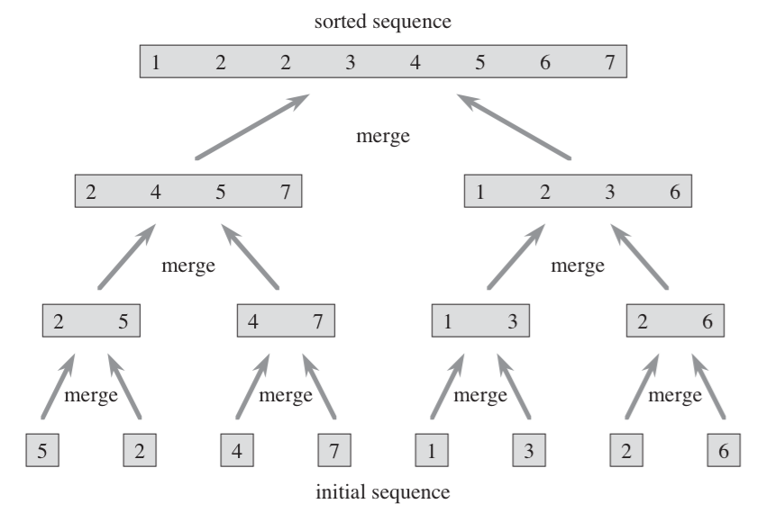
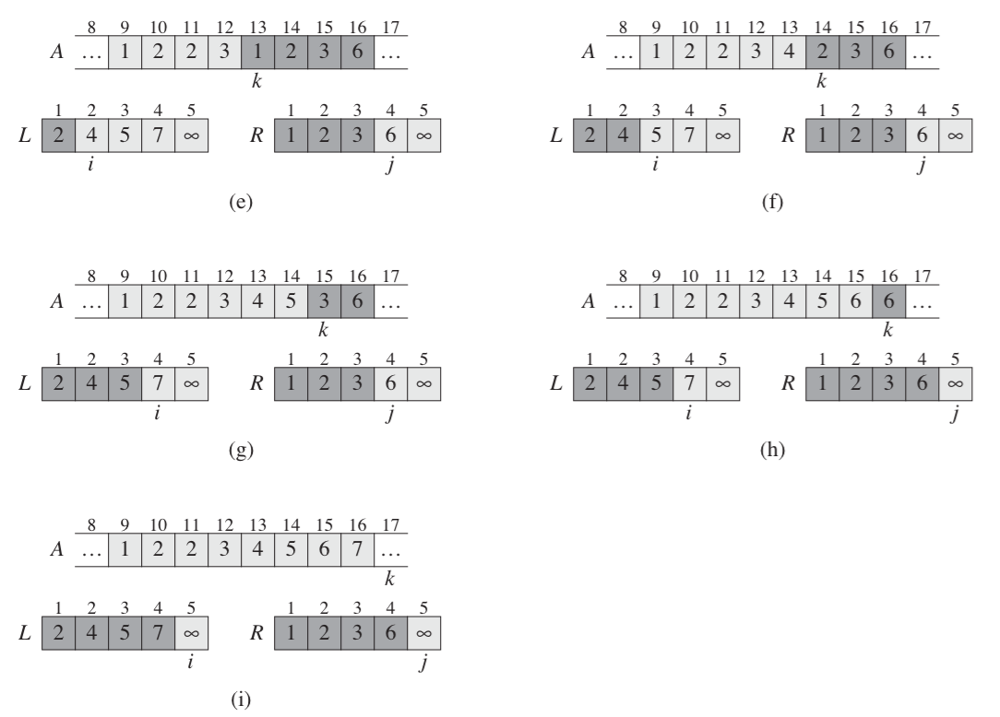

#Merge Sort
Merge sort is a recursive sorting algorithm. It works by taking an array and recursively dividing the array into two components, odd or even. The recursion stops when there is a single item on either sides.

From their the two arrays are passed into a merge algorithm that iterates on counts of  **left side + right side** and looks at both arrays forming a new array with items pulled from each until *n* is reached. This will ensure that all sides are sorted.

Merge sort is solved in logarithmic base 2 time.

##Image



##Pseudocode
```swift
// code for recursion

sort(array) {
	if (array.length <= 1)
		return array
	
	mid = floor array.length / 2
	left = sort(array[0..mid])
	right = sort(array[mid..array.length])
	
	return merge_sort(left, right)
}

merge_sort(left, right) {
	
	count = left.length + right.length
	newArray = []
	
	leftCount = left.length
	rightCount = right.length
	for count {
		if (left[leftCount] <= right[rightCount])
			newArray[i] = left[leftCount]
			leftCount++
		else if (right[rightCount] <= left[leftCount])
			newArray[i] = right[rightCount]
			rightCount++
	}
	
	return newArray
}

```


##PHP
```php
<?php

$ages = [8,1,2,4,5,2,8,6,4,2];

var_dump(sortAges($ages));

function sortAges($ages) {

	if (count($ages) <= 1) {
		return $ages;
	}

	$mid = count($ages) / 2;
	$left = sortAges(array_slice($ages, 0, $mid));
	$right = sortAges(array_slice($ages, $mid));

	return merge_sort($left, $right);
}

function merge_sort($left, $right) {

	$newArray = [];
	$leftCount = 0;
	$rightCount = 0;

	for ($i=0; $i < (count($left) + count($right)); $i++) {

		if (!empty($left[$leftCount]) && ($left[$leftCount] <= $right[$rightCount] || empty($right[$rightCount]))) {
			$newArray[$i] = $left[$leftCount];
			$leftCount++;
		} else if (!empty($right[$rightCount]) && ($right[$rightCount] <= $left[$leftCount] || empty($left[$leftCount]))) {
			$newArray[$i] = $right[$rightCount];
			$rightCount++;
		}

	}
	
	return $newArray;
}
```