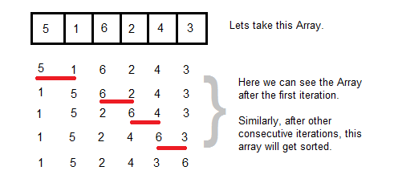

#Bubble Sort
Bubble sort works by iterating over *n* number of items in an array and swapping out neighbours within each iteration, left to right. Each pass is n-1 so that the highest number moves to the right and progressively smaller numbers move to the left.

##Image


##Pseudocode
```php
for i in ages.length
	for j in ages.length - i - 1
		if ages[j] > ages[j + 1]
			swap j with j + 1
```

##PHP
```php

$ages = [5,6,3,8,2,6,4,2,7,9,0];
var_dump(bubbleSort($ages));

function bubbleSort($ages) {
	for ($i=0; $i < count($ages); $i++) {
		for ($j=0;$j < count($ages) - $i - 1;$j++) {
			if ($ages[$j] > $ages[$j + 1]) {
				$swappedVar = $ages[$j];
				$ages[$j] = $ages[$j + 1];
				$ages[$j + 1] = $swappedVar;
			}
		}
	}
}
```