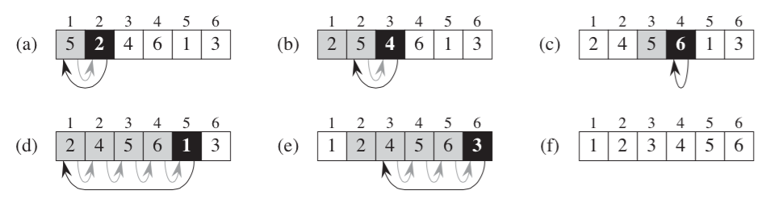

#Insertion Sort

Insertion sort works by taking an array, iterating from left to right. Within this loop is another loop that looks at the current index and works back to the left direction until it is either furtherest to the left or if its neighbour to its left is less than the current shifting index.

##Image


##Pseudocode

```swift

ages = [8, 2, 9, 1, 3, 4, 6]

for (i=1; i < ages.length; i++)
	age = ages[i]
	i =  i - 1
	while i >= 0 and ages[i] > age
		// previous placement is greater than the one we're looking at
		// so shift it over to the right
		ages[i + 1] = ages[i] 
		i--
	ages[i] = age
```

##PHP
```php
<?php

$ages = [8, 2, 9, 1, 3, 4, 6];

for ($i = 1; $i < count($ages); $i++) {
	$age = $ages[$i];
		
	while ($i >= 0 && $ages[$i - 1] > $age) {
		$ages[$i] = $ages[$i - 1];
		$i--;
	}
	
	$ages[$i] = $age;
}

var_dump($ages);

```